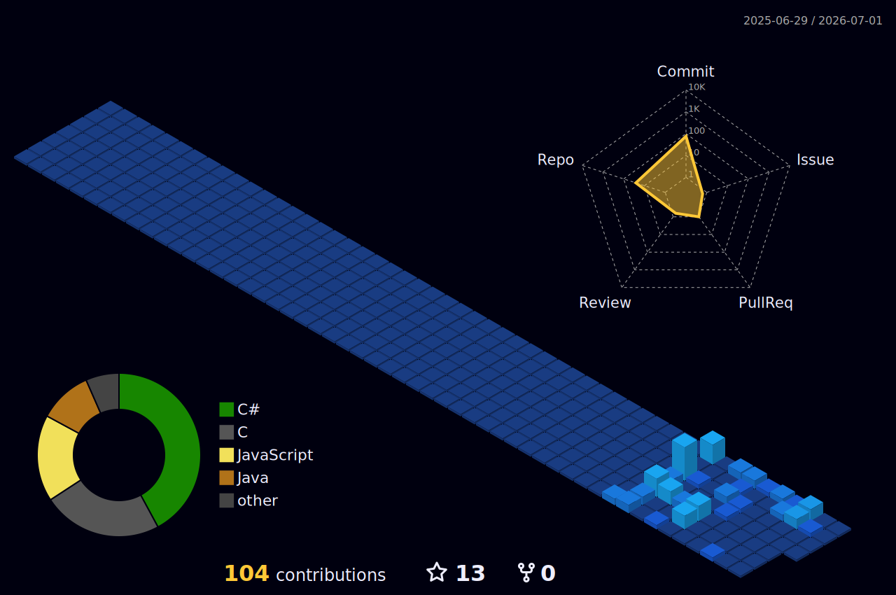

  

 

## 👨‍💻 About Me

- 🚀 I am a university student **deeply passionate about the software world**, continuously open to learning and development.
- 🧠 I greatly enjoy discovering new technologies and strive to produce practical, effective results by approaching problems with a **solution-oriented** mindset.
- 🤝 I am adaptable to teamwork, open to communication, and **never hesitate to take responsibility**.
- 🛠️ Technically, I have developed myself in **C#, .NET, Entity Framework, and SQL**, and I continue to gain experience by building projects in these areas.
- 📱 I am currently focusing on mobile application development with **.NET MAUI**, one of my biggest interests, aiming to design modern and user-friendly applications.

 

## 💻 Technologies & Tools

### 🔤 Languages

### 🌐 Frontend

### ⚙️ Backend & Database

### 🛠️ Tools & Design

 

 

## 🔥 Contribution Graph (Last 365 Days)

  

 

## 📊 GitHub Stats

  <table>
    <tr>
      <td align="center">
        
      </td>
      <td align="center">
        
      </td>
    </tr>
  </table>
   
  

