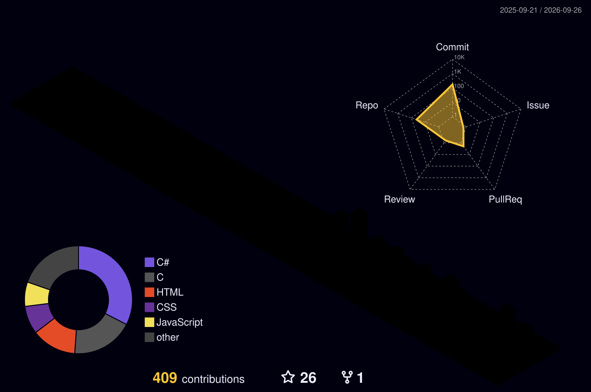

<div align="center">
  <picture>
    <source media="(prefers-color-scheme: dark)" srcset="https://capsule-render.vercel.app/api?type=waving&color=0:4A71D9%2C100:00c6ff&height=200&section=header&text=Kaaner4x&fontSize=50&fontColor=ffffff&animation=fadeIn&fontAlignY=35&desc=Junior%20.NET%20Developer%20%7C%20Full-Stack%20Candidate&descAlignY=55&descAlign=50">
    <source media="(prefers-color-scheme: light)" srcset="https://capsule-render.vercel.app/api?type=waving&color=0:E2E2E2%2C100:C9D6FF&height=200&section=header&text=Kaaner4x&fontSize=50&fontColor=000000&animation=fadeIn&fontAlignY=35&desc=Junior%20.NET%20Developer%20%7C%20Full-Stack%20Candidate&descAlignY=55&descAlign=50">
    
  </picture>
</div>

<div style="text-align: center;">
  <a href="https://github.com/Kaaner4x">
    
  </a>
</div>

<div align="center">
  
  &nbsp;
  <a href="https://www.linkedin.com/in/kaaner4x/" target="_blank">
    
  </a>
  &nbsp;
  <a href="https://kaaner4x.github.io/me/" target="_blank">
    
  </a>
  &nbsp;
  <a href="mailto:kaaner.emirhan@gmail.com">
    
  </a>
</div>

<p align="left">
  👋 <b>Hi there, welcome to my profile!</b><br><br>
  I'm a Computer Programming student deeply passionate about software engineering and problem-solving. My core focus isn't just writing code that works, but engineering high-quality solutions adhering strictly to <b>Clean Code</b> principles, <b>SOLID</b> design patterns, and maintainable architectures (<b>Clean Architecture</b>).<br><br>
  I primarily build high-performance backend systems and full-stack web applications with <b>C# and the modern .NET ecosystem</b> (ASP.NET Core, EF Core, Dapper, PostgreSQL, MSSQL, and Docker). Alongside backend engineering, I actively explore data structures, algorithm optimization, and AI integrations while contributing to open-source software.<br><br>
  <em>"Always learning, staying curious, and turning coffee into clean, scalable code."</em> ☕🚀
</p>

``` python
import torch.nn as nn

class Kaaner4x(nn.Module):
    def __init__(self):
        super().__init__()
        self.role = "Junior .NET Developer | Full-Stack Candidate 🚀"
        self.about = "University student passionate about software, solution-oriented, and open to continuous learning."
        
        self.languages = ["C# 💜", "Java ☕", "C ⚙️", "Python 🐍"]
        self.frontend = ["HTML5 🌐", "CSS3 🎨", "JavaScript 💛", "Bootstrap 🅱️", "TailwindCSS 💨"]
        self.backend_and_db = ["ASP.NET Core 🌐", "EF Core ⚡", "Dapper 🚀", "MSSQL 🗄️", "PostgreSQL 🐘"]
        self.tools = ["Visual Studio 🟣", "VS Code 💙", "Docker 🐳", "Git 🛠️"]
        self.platforms = ["Windows 💻", "Linux 🐧"]

    def forward(self, coffee):
        architecture = self.design_backend()
        database = self.connect_data_layer(architecture)
        ui = self.build_frontend_interface(database)
        return self.deploy_fullstack_app(ui)
```

---

### 🚀 Featured Projects

<div align="center">
  <a href="https://github.com/Kaaner4x/modern-portfolio">
    
  </a>
  <a href="https://github.com/Kaaner4x/qubix-cinema">
    
  </a>
</div>
<div align="center">
  <a href="https://github.com/Kaaner4x/readify">
    
  </a>
  <a href="https://github.com/Kaaner4x/mmr-balancing-engine">
    
  </a>
</div>

<br/>

| Project | Description | Tech Stack |
| :--- | :--- | :--- |
| 🌐 **[modern-portfolio](https://github.com/Kaaner4x/modern-portfolio)** | High-performance developer portfolio and CMS administration console. | `ASP.NET Core (.NET 10)` `Clean Architecture` `Dapper` `PostgreSQL` `Docker` |
| 🎬 **[qubix-cinema](https://github.com/Kaaner4x/qubix-cinema)** | Comprehensive Cinema Management System with movie scheduling, ticketing, and reporting. | `.NET` `C#` `EF Core Code-First` `DevExpress` `MSSQL` |
| 🤖 **[readify](https://github.com/Kaaner4x/readify)** | AI-powered CLI tool that analyzes codebases to generate comprehensive READMEs and diagrams. | `Python` `Google Gemini AI` `CLI` `Draw.io` |
| ⚖️ **[mmr-balancing-engine](https://github.com/Kaaner4x/mmr-balancing-engine)** | Competitive matchmaking queue and ELO simulation engine utilizing a dynamic Snake Draft pattern. | `.NET Worker Service` `C#` `ELO Algorithm` `Spectre.Console` |
| 💬 **[ask-gemini](https://github.com/Kaaner4x/ask-gemini)** | Zero-dependency, interactive terminal chatbot natively powered by Google Gemini AI. | `C#` `.NET` `Google Gemini API` `Console` |
| 🧪 **[csharp-mastery](https://github.com/Kaaner4x/csharp-mastery)** | Deep-dive C# and .NET lab covering memory management, SOLID principles, and interview challenges. | `C#` `.NET` `OOP` `Memory Management` `Design Patterns` |
| 💳 **[iso-iec-7812](https://github.com/Kaaner4x/iso-iec-7812)** | ISO/IEC 7812 compliant card validation, MII sector detection, and Luhn checksum library in C. | `C` `ISO/IEC 7812` `Luhn Algorithm` `Data Structures` |

---

### 📊 GitHub Statistics & Activity

<div align="center">
  <a href="https://github.com/Kaaner4x">
    
  </a>
  <a href="https://github.com/Kaaner4x">
    
  </a>
</div>

<br/>

<div align="center">
  <a href="https://github.com/Kaaner4x">
    
  </a>
</div>

<br/>

<div align="center">
  
</div>

<br/>

<div align="center">
  <picture>
    <source media="(prefers-color-scheme: dark)" srcset="https://capsule-render.vercel.app/api?type=waving&color=0:4A71D9%2C100:00c6ff&height=120&section=footer">
    <source media="(prefers-color-scheme: light)" srcset="https://capsule-render.vercel.app/api?type=waving&color=0:E2E2E2%2C100:C9D6FF&height=120&section=footer">
    
  </picture>
</div>